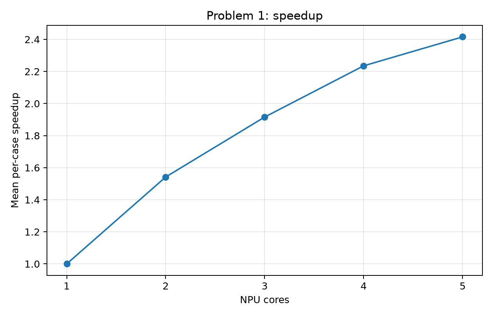
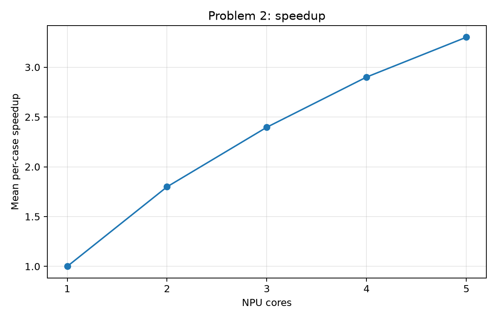
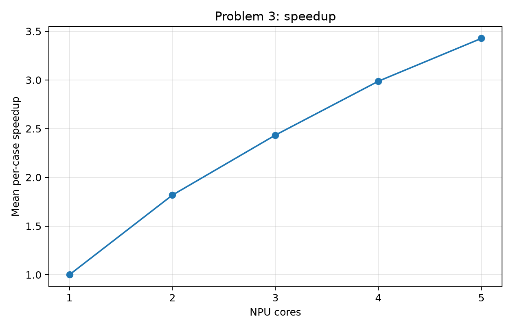
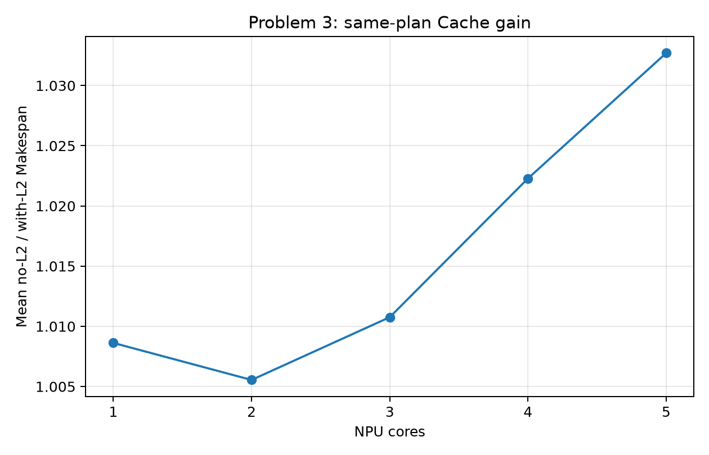

# A 题第七版：100 例全量验证报告（2026-09-24）

## 结论

第七版完成全部 **100 个官方算例 × 2/3/4/5 核 × A/B/L2 三场景 = 1200 个场景结果**，以及 100 个单核基准。所有 1200 个最终方案通过结构审计，失败记录为 0，四张报告图均已生成；运行清单标记为 `status=complete`、`full_experiment_complete=true`。与第四版在相同 100 例上按 `(Makespan, added_copy_bytes)` 字典序逐项比较，**978 项改善、222 项持平、0 项退步**。

用户设定的 **各场景、各核数平均加速比 5.0** 仍未达到。当前最好的 L2/5 核为 **3.4269 倍**，A/2 核为 **1.5419 倍**。第七版相对第四版的提升是有效但有限的，不宜把“0 项退步”或部分算例的大幅改善解释成接近 5 倍目标。

## 实验口径

- 单例加速比 = 该例单核基准 Makespan / 相应场景和核数的最终 Makespan；下表对 100 例的单例加速比取算术平均。单核基准与第四版的 100 例记录逐项一致。
- 第四版与第七版使用同一批算例、同一单核分母；相对提升 = `第七版平均加速比 / 第四版平均加速比 - 1`。搬运量只在 Makespan 持平时作为第二排序指标。
- 第七版在官方模拟器下搜索，2/3/4/5 核分别运行；小图每个场景最多 72 次、大图最多 44 次完整官方评估。使用 8 个并行工作进程，并从已验证的第四版、第五版以及先前第七版运行结果中读取种子，再按当前官方模拟器重评。
- 因为使用了前代和先前第七版种子，下表是**最终方案对比**，不能把全部增益单独归因于某一项新增邻域或预检。与第五版的全量配对比较不在本报告范围内。

## 各核数平均加速比

每格均有 **100 例**。加速比相对提升与逐例 Makespan 平均降幅不是同一个统计量；完整数值和后者见 [汇总 CSV](full_100_comparison_20260924.csv)。

| 场景 | 核数 | 第四版 | 第七版 | 平均加速比相对提升 | 第七版改善/持平/退步 |
|---|---:|---:|---:|---:|---:|
| A | 2 | 1.4915 | **1.5419** | +3.380% | 94 / 6 / 0 |
| A | 3 | 1.8363 | **1.9159** | +4.333% | 96 / 4 / 0 |
| A | 4 | 2.1150 | **2.2353** | +5.686% | 97 / 3 / 0 |
| A | 5 | 2.3016 | **2.4159** | +4.966% | 95 / 5 / 0 |
| B | 2 | 1.7683 | **1.7988** | +1.719% | 67 / 33 / 0 |
| B | 3 | 2.3417 | **2.3971** | +2.366% | 75 / 25 / 0 |
| B | 4 | 2.8334 | **2.9011** | +2.389% | 79 / 21 / 0 |
| B | 5 | 3.2330 | **3.3010** | +2.103% | 71 / 29 / 0 |
| L2 | 2 | 1.7810 | **1.8179** | +2.072% | 71 / 29 / 0 |
| L2 | 3 | 2.3690 | **2.4340** | +2.743% | 77 / 23 / 0 |
| L2 | 4 | 2.8867 | **2.9874** | +3.486% | 80 / 20 / 0 |
| L2 | 5 | 3.3189 | **3.4269** | +3.255% | 76 / 24 / 0 |

官方汇总中的 L2 同方案缓存收益（无 L2 Makespan / 有 L2 Makespan）在 2/3/4/5 核分别为 **1.0055 / 1.0108 / 1.0223 / 1.0327**。这衡量的是缓存开关效果，与上表相对单核的多核加速比不同。

## 验证与复核

运行目录为 `C:\Users\lin\Documents\Codex\2026-09-23\wqo\outputs\npu7_full_20260924\20260924_104002_885e4e`。其中 `manifest.json` 报告完成，`reports/validation.json` 为 `status=ok`、`issues=[]`、`checked_plans=1200`，`reports/failures.csv` 无失败行，`process_failures=[]`。收尾审计本身未重放全部方案（`replayed=0`）；每个作业的候选评分来自运行时官方模拟器。另运行 `python npu_7/verify.py <运行目录> --replay`，对 case_001、case_051、case_100 的四种核数与三种场景共 **36 个最终方案**进行独立官方重放，全部分数吻合；12 个 L2 同方案配对重放也无不一致。第七版 8 项单元测试通过。

本轮最初因运行环境缺少 `matplotlib` 未能生成图表，搜索结果和 1200 方案审计已完成；安装绘图库后在**同一运行目录**恢复收尾，未重复搜索，最终生成四张图并取得完整完成标记。

完整原始方案、逐场景作业记录、官方汇总及审计 JSON 保存在上述本机运行目录；仓库仅保存此报告、汇总 CSV 和四张图，避免提交大量原始输出。

## 下一轮算法重点

A 场景 5 核平均仅 2.4159 倍，是最明显的并行效率瓶颈；B 和 L2 的 5 核虽分别达到 3.3010、3.4269 倍，仍显著低于 5.0 目标。下一步应在全量结果中按算例识别限制 Makespan 的核心、关键路径、依赖等待和跨核搬运，再针对高耗时算例做可回退的邻域搜索与配对消融。对 2–4 核的 5 倍目标，应先计算任务工作量与依赖下界，判断是否存在足够的超线性收益空间；仅靠重新分配相同工作量通常达不到该值。
