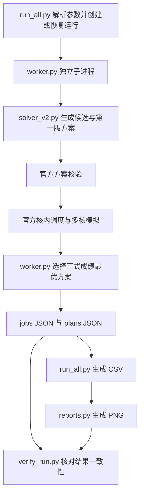

# 代码结构与函数说明

本说明针对当前仓库实现，用于阅读和修改算法。主程序不训练神经网络；它为已给定的 NPU 计算图生成切分与分核方案，再调用官方模拟器取得成绩。算法思想见 [算法与实验方案](算法与实验方案.md)，输出字段与图表见 [结果字段与图表解读](结果字段与图表解读.md)。

## 1 从输入到图表的调用关系

`run_all.py` 用线程管理独立的 Python 子进程。实际计算发生在子进程中，因此可以使用多个 CPU 核；Windows 下也不要求 Unix `fork`。每个子进程只承担一个用例、一个场景、一个核数组合，超时后由父进程结束它。

## 2 文件职责

| 文件 | 职责 | 修改时主要关注 |
|---|---|---|
| `run_all.py` | 运行范围、进程调度、续跑、汇总、状态记录 | 任务覆盖和文件关系 |
| `solver_v2.py` | 构造并用近似分数筛选候选方案 | 切分粒度、拓扑优先级、分核代价 |
| `worker.py` | 调用评估器、比较候选、保存选中方案、一次局部搜索 | 正式成绩比较、题三配对 |
| `reports.py` | 从 CSV 绘制六张图 | 指标口径、分组和标签 |
| `verify_run.py` | 静态检查记录是否齐全及相互一致 | 检查能证明和不能证明的范围 |
| `tests/test_core.py` | 方案接口、基线回退、配对及目录相关测试 | 修改后是否破坏已有契约 |
| `requirements.txt` | 绘图依赖 | 它是版本范围约束，不是完整环境锁文件 |

上一级 `code/` 是官方实现。`singlecore_evaluate.py` 提供单核基准；`multicore_cut_evaluate_problem_1/2/3.py` 分别负责 A、B 和 L2；`schedule_step1/2/3.py` 负责确定性拓扑顺序、换入换出和 Pipe 排布；`evaluation_validation.py`、`stub_multicore_cut_and_schedule.py` 负责图、配置和方案检查。第二版不会把自己估计的时间当作正式成绩。

## 3 solver_v2.py

### 路径初始化

由当前文件确定附件根目录，检查官方目录和第一版目录，将它们加入 `sys.path`，并设置第一版模块需要的 `MULTICORE_OFFICIAL_CODE`。然后复用第一版 `_graph_view` 和 `generate_plan`。因此第一版代码是运行依赖，不仅是历史参考资料。

### 主要函数

| 函数 | 输入与输出 | 处理内容 |
|---|---|---|
| `_topological_orders` | 操作字典、合法拓扑序、前驱字典 → 三种序列、rank、输出大小代理 | 用堆选择就绪节点；并列按 id 决定，保持确定性 |
| `_partition` | 一条拓扑序、目标块大小、容量代理 → blocks、block_of | 在目标大小附近选切口，平衡计算工作量与跨切口数据 |
| `_schedule_blocks` | 子图、依赖、核心数、场景及配置 → plan、近似 score | 依次选择就绪子图并试放到各核，形成每核顺序 |
| `generate_candidates` | graph、2～5 核、A/B/L2、config、limit → 候选列表 | 默认最多返回两条 `(label, plan, surrogate_score)` |
| `legacy_plan` | graph、核数、场景 → plan | 调用第一版求解器作为比较基线 |

核心数据结构：`preds[dst][src]=(size,shared)` 表示收缩后的操作依赖；`blocks[sgid]` 存放操作 id；`block_of[op_id]` 反向定位子图；`incoming[target][source]` 汇总子图边的近似大小和共享标记；`core_end`、`end`、`assigned` 分别记录估计的核心可用时刻、子图完成时刻和分配核心。

三种序列的 heap 优先级分别是：

| 模式 | 排序键 | 限制 |
|---|---|---|
| `critical` | `(-rank, id)` | rank 使用计算周期，不包含精确的带宽争用 |
| `reuse` | `(-shared_in, -rank, id)` | shared 是第一版的图结构启发式标记，并非缓存命中判定 |
| `memory` | `(output_size, -rank, id)` | output_size 为该操作外出依赖的最大权重，未实现真实张量生命周期分析 |

`shared` 的来源是第一版对不超过 1 MiB 且有多个消费者的张量的识别，并经 COPY 收缩传播。它不等于“确认可命中的 DDR 原始输入”。边权在收缩时使用最大值等近似规则，同一个 tensor 的共享关系也可能被映射成多条依赖，因此这些字节量不能直接当成最终 COPY 流量。

每种排序尝试最多四档粒度，合计最多十二种原始候选，然后排序取近似分数最小的两种。候选去重按映射项及核心列表的内部表示判断，不是对所有语义等价方案做图同构去重。`v2_critical_332` 这类标签表示“关键路径优先、目标块大小 332”，不是实际子图数量，也不保证每个子图恰好有 332 个操作。

## 4 worker.py

### 基础函数

| 函数 | 职责 |
|---|---|
| `settings` | 从统一 `data/config.txt` 读取容量、DDR 带宽、场景延迟和 L2 参数 |
| `official_evaluate` | 分派到三个官方评估入口，提取 Makespan、搬运、内存峰值及 Cache 指标 |
| `score` | 返回 `(makespan, added_copy_bytes)`，用字典序比较 |
| `attempt` | 校验并评估一个候选；成功加入 evaluations，失败加入 errors 后返回 None |
| `atomic_json` | 先写临时文件再替换目标文件，降低单个 JSON 写到一半的风险 |
| `file_hash` | 计算题二方案文件的 SHA-256，追踪题三配对是否过期 |

正式候选的选择依次比较 Makespan 和额外搬运量。完全相同的两个元组保留先评估的候选。A/B 的第一版最先评估，因此 `selected_source=v1` 可以表示新候选没有胜过它；“第二版运行结果”包含这种基线回退，并不意味着每一组都选中了新启发式。

### 三种任务

`run_singlecore` 执行三次官方计算：整图单核基准、同一整图单子图方案在 B 下的结果、同一方案在 L2 下的结果。后两者用于题三单核点。只有三次都成功才保存该单核任务记录。

`run_job` 在 A/B 下通常比较第一版加两个第二版候选。在 L2 下，先读取题二最终方案，分别评估 B 和 L2 得到配对；再将这个方案、第一版 L2 方案和两个 L2 候选一起比较。选中的题三方案可与配对所用的题二方案不同。配对评估不齐时，题三任务不能标为成功。

`search_job` 从已经选中的方案生成一次有限邻域。邻居基于进入本次搜索时的同一方案生成，逐个评估后保留最好者；不会每接受一次改进就重新生成邻居，也不做随机多轮搜索。

| 变化标签 | 当前具体行为 |
|---|---|
| `migrate` | 按非 COPY 操作数量选最重、最轻核心，将重核最后一个子图移到轻核第一个合法插入位置 |
| `swap` | 尝试交换上述两核的最后一个子图 |
| `merge` | 对遇到的第一个至少有两个子图的核心，尝试合并其最后两个子图 |
| `reorder` | 尝试交换同一对最后两个子图的顺序 |
| `split` | 按操作数量找最大子图，用操作拓扑顺序对半拆分，放到原核相邻位置 |

非法邻居被丢弃，最多评估五个合法邻居。“最重核心”目前依据操作数量，而不是周期、带宽或官方执行时间；这些细节是后续改进的明确切入点。

### 保存与计时

`plans/` 保存最终可提交 JSON，`jobs/` 保存初始比较及当前选中指标，`search_jobs/` 保存可选搜索评估。搜索更新最终方案和 `selected` 后，初始 `evaluations` 列表不会追加搜索记录，应到 `search_jobs/` 查看。

`generation_seconds` 在 A/B 中主要覆盖候选构造；L2 中由于配对先执行，该字段还包含两次配对评估时间。`total_seconds` 是初始 worker 的处理时长，通常不含读图耗时，也不包含后来搜索和绘图；不能将它当成整套程序总时长。逐候选 `evaluation_seconds` 记录官方评估调用耗时，不含它前面执行的方案校验。

## 5 run_all.py

| 函数 | 输入输出与作用 |
|---|---|
| `_case_names` | 解析用例范围，先检查数据目录有 100 个正式 case 文件 |
| `_create_or_resume` | 创建唯一时间戳目录，或检查原清单的用例、核数和配置哈希 |
| `_job_file` | 将场景和任务类型转换为结果文件路径 |
| `_invoke` | 用当前解释器启动 worker；捕获输出、返回码和超时 |
| `_run_phase` | 跳过完成任务、识别过期题三记录、并发提交剩余任务 |
| `summarize` | 从 jobs 重建三个 summary.csv、单核表和失败表 |
| `_aggregate` | 按场景、核数对逐用例比值求算术平均 |
| `main` | 串联必需评估、搜索、配对刷新、绘图、验证及结束状态 |

搜索按 A → B → L2 依次提交。B 搜索后，即使搜索预算用尽，也要刷新 B 方案已变更的题三必需配对。题三记录中的 `b_plan_sha256` 与当前 B 方案文件哈希不同，便会触发重算。

JSON 单文件使用原子替换，但方案 JSON 和指标 JSON 不是一组跨文件事务。遇到中断、手工改动或怀疑不一致时，应重新校验相关运行，并按需用官方评估器复评最终方案。

## 6 reports.py 和 verify_run.py

`build_plots(run)` 读取该运行的 `reports/aggregate.csv`、题一至三的 `summary.csv` 和 `baseline/singlecore.csv`，用 Matplotlib 的 Agg 后端生成 PNG。它不调用求解器，也不评估方案。图表口径见 [结果字段与图表解读](结果字段与图表解读.md)。

`validate(run, require_plots=True)` 检查清单选定范围内单核记录、三问结果及方案是否存在，Makespan 是否有效，A/B 是否有第一版记录，最终成绩是否劣于已记录的基线；并检查 B 方案哈希、L2 配对无缓存 Makespan 与题二结果的一致性，以及需要的六张 PNG 是否存在。

该检查不重新模拟最终方案，不完整重算全部 CSV 公式，不检查 PNG 内容或最优性，也不自动把 3 用例快速实验视为缺失 97 例。最终论文验收还应核对清单范围和样本数。

## 7 修改算法时的工作顺序

Mac 上先定位要改进的行为：排序和切分改 `solver_v2.py`，邻域操作改 `worker.py`，统计口径改汇总与绘图代码。新增场景或改变方案格式需要同时检查官方接口，避免把额外字段写进提交 JSON。

将更新后的项目复制到强 CPU 电脑，先运行接口测试和定向验证，再做全量实验。算法版本变化后新建运行目录；不要用旧任务的成功标记跳过本应重算的实验。对比时保持用例、核数、配置和预算口径一致，并在 [交接记录](交接记录.md) 中记录源码变更与运行编号。

当前 `seed=2026` 仅写入清单，第二版排序和局部搜索没有调用随机数搜索；不能将这个字段描述为多随机种子试验。完整源码、数据版本与环境并未被自动快照，正式交接应另外保留对应代码副本。
