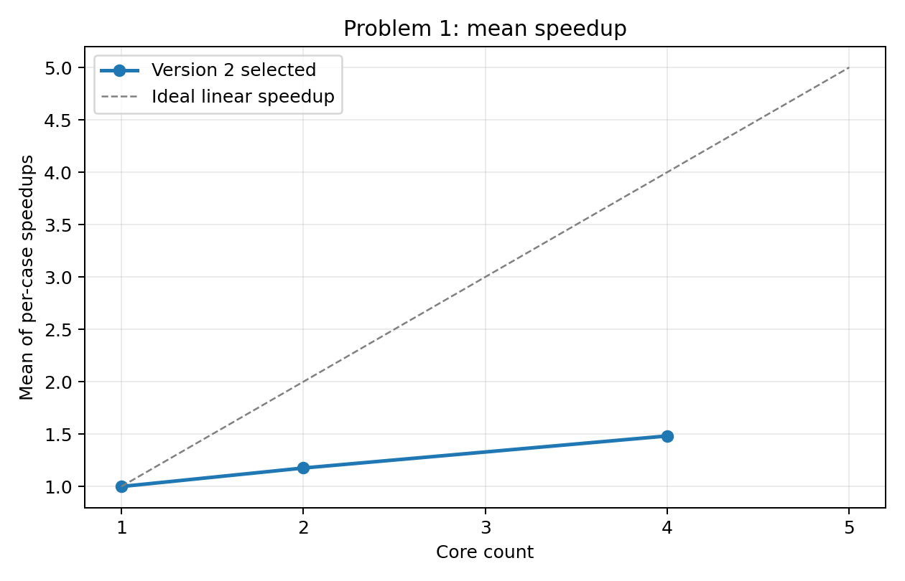
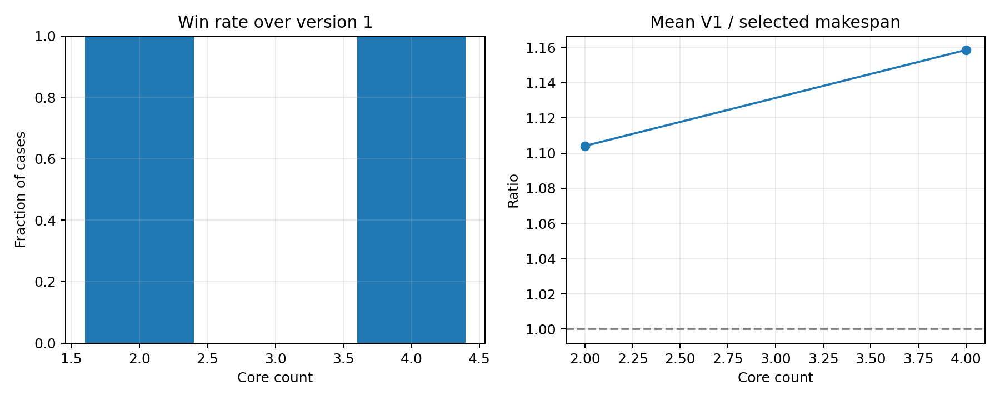
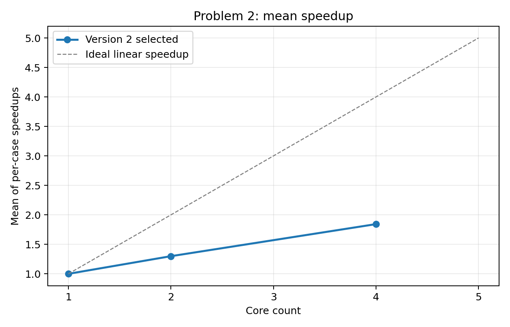
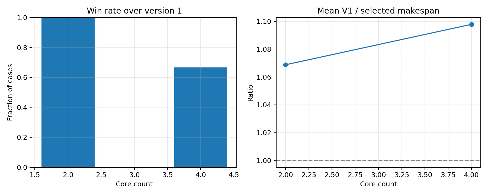
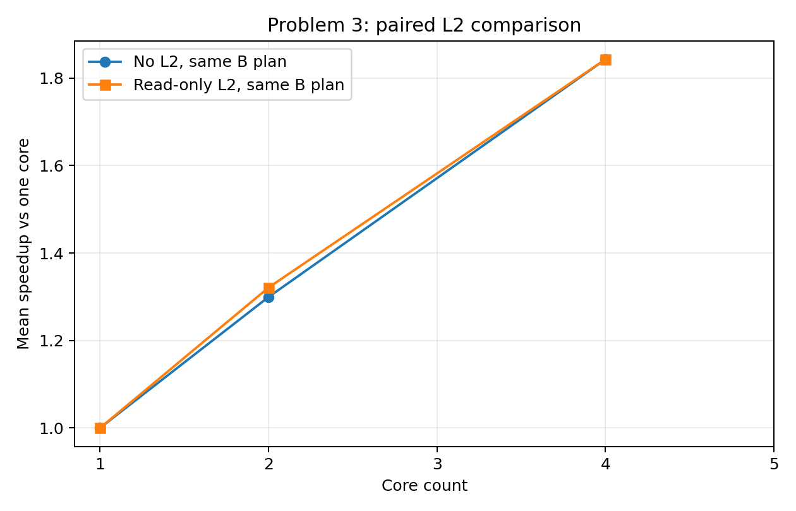
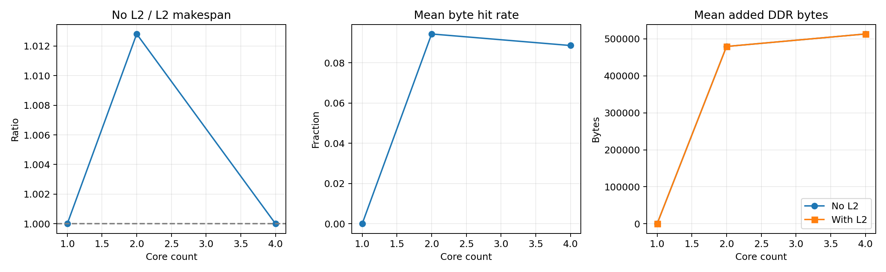

# 运行结果与六张图的完整解读

本说明解释每个结果文件、主要字段、六张 PNG 的坐标和计算方式，并给出已完成快速实验的读图示例。所有数值来自官方 NPU 模拟器；电脑 CPU 用于运行求解与模拟程序，图中的核心数指模拟 NPU 核心数。

## 1 打开图之前先确认运行范围

先看同一运行目录中的 `manifest.json`：`cases` 是实际用例，`cores` 是多核配置，`quick` 记录创建时是否用了快速模式，`status` 是该次运行状态。`complete` 只说明清单选定范围完成；3 例快速验证和 100 例正式实验都可能是 `complete`。

当前示例目录是 [20260923_112127_774c74](runs/20260923_112127_774c74/manifest.json)，有 `case_001`、`case_019`、`case_035` 三个用例，测试 2、4 核，并计算单核参照。因此图中只有 1、2、4 核的点。3 核位置穿过的直线只是连线；横轴显示 5 也不表示已经测试 5 核。把这个目录复制给队友时，应一并保留清单。

## 2 术语与指标方向

| 名称 | 单位与定义 | 如何理解 |
|---|---|---|
| Makespan | cycles，模拟任务中最晚操作结束时刻 | 越小越快，是主要优化目标 |
| 单核加速比 | `单核 Makespan / 当前 Makespan` | 大于 1 表示比整图单核基准快 |
| 相对第一版加速比 | `第一版 Makespan / 当前 Makespan` | 大于 1 表示优于第一版 |
| L2 配对加速比 | `同方案无 L2 Makespan / 同方案有 L2 Makespan` | 大于 1 表示增加 L2 缩短了时间 |
| 额外搬运量 | bytes，官方统计的调度后 COPY 流量减原图 COPY 流量 | 衡量切分、重复读取及换入换出成本；是次要指标 |
| Cache 命中率 | 命中字节 /（命中字节＋未命中字节） | 按字节计算，不是命中次数占比 |
| 程序耗时 | seconds，CPU 上执行生成或评估所花的现实时间 | 用于判断算法运行成本；不是模拟 Makespan |

例：某一个用例单核 100,000 cycles，多核 50,000 cycles，则加速比为 2，执行时间减少 50%。单个用例的加速比 1.10 对应时间减少约 `1−1/1.10=9.09%`；不要将它说成时间减少 10%。对多个用例的平均加速比不能直接取倒数来获得平均时间降幅。

加速比的总体统计采用“先逐例相除，再取算术平均”：

\[
S_{i,k}=\frac{T_i^{single}}{T_{i,k}},\qquad
\overline S_k=\frac{1}{N}\sum_{i=1}^{N}S_{i,k}.
\]

这不同于 `所有单核时间之和 / 所有多核时间之和`。例如两个用例分别从 100 变 50、从 1,000 变 1,000，平均加速比是 `(2+1)/2=1.5`，而时间总和之比约为 1.048。现有曲线采用前一种，所有用例权重相同。

## 3 每个文件用来做什么

| 文件或目录 | 内容与用途 |
|---|---|
| `manifest.json` | 本次用例、核数、参数、配置哈希、Python 版本及状态 |
| `baseline/jobs/<case>.json` | 单核基准及单核无 L2／有 L2 的配对数据 |
| `baseline/singlecore.csv` | 所有已成功单核任务的汇总 |
| `problem_1/2/3/plans/<case>_<k>core.json` | 各问题最终选中的方案，可交给对应官方评估器复评 |
| `problem_1/2/3/jobs/<case>_<k>core.json` | 一组配置的候选成绩、选中来源、第一版对照、错误信息 |
| `problem_1/2/3/search_jobs/` | 局部搜索的邻居评估及是否取得改进 |
| `problem_1/2/3/summary.csv` | 逐用例、逐核数的数值表，适合整理论文附录 |
| `reports/aggregate.csv` | 按场景和核数汇总的均值、胜率、样本数 |
| `reports/failures.csv` | 必需结果缺失、失败或绘图／验证错误；只有表头表示该表没有错误记录 |
| `reports/worker_failures.csv` | worker 进程错误、超时及输出片段；仅在捕获到这类失败时写入，旧文件可能跨续跑保留 |
| `reports/validation.json` | 当前已保存文件的一致性检查，`issues=[]` 表示该检查未发现问题 |
| `reports/*.png` | 六张图；由已有 CSV 生成 |
| `reports/matplotlib_cache/` | 字体等绘图缓存，与实验成绩无关 |

`manifest.json` 在运行目录根部，不在 `reports/` 内。PNG 是汇总视图，发生疑问时应回到该组 `jobs` 和 `plans` 查证。`validation.json` 为 `ok` 不代表重新跑过所有方案，也不证明最优性。

## 4 六张图逐一解读

### 图一 problem_1_speedup.png

对应题一场景 A：每个子图独立构成 Task，跨子图数据需要 DDR 中转。

- 横轴 `Core count`：模拟核心数。
- 纵轴 `Mean of per-case speedups`：该核数下所有用例相对单核的加速比算术平均。
- `Version 2 selected`：第二版流程最终选中的方案，可能包含第一版回退方案，也可能经过局部搜索。
- `Ideal linear speedup`：灰色虚线 `y=k`，例如四核理想参照为 4 倍。
- 数据来源：`aggregate.csv` 中 `scene=A` 的 `mean_speedup`。

曲线越高表示平均成绩越好。核数增加但曲线趋平时，可能存在依赖链、DDR 争用、Task 同步或切分带来的额外搬运；必须结合指标或 Trace 才能确定原因。灰线是理想扩展参照，不是对本问题所有方案已证明的严格上界，因为切分还可能改变缓存换出和核内启发式排布。

### 图二 problem_1_vs_v1.png

对应题一，比较相同用例、相同核数下第一版和当前最终方案。**第一版基线与单核基线不同。**

| 子图 | 轴与指标 | 如何读 |
|---|---|---|
| 左侧 `Win rate over version 1` | 横轴核数，纵轴严格胜出用例比例 | 1 表示每个用例的 Makespan 都更小；0.5 表示一半用例胜出 |
| 右侧 `Mean V1 / selected makespan` | 横轴核数，纵轴 `T_v1/T_selected` 的算术平均 | 大于 1 表示平均加速比优于第一版；虚线 1 为相同水平 |

胜率仅按 Makespan 严格变小计数。时间持平但额外搬运量更小，正式选择器可能接受它，左图仍不计为胜出。回退保证依赖第一版成功评估并参与候选比较；它不等于证明第二版找到了全局最优。

数据来源为 `problem_1/summary.csv` 的 `makespan`、`v1_makespan` 和 `gain_over_v1`。

### 图三 problem_2_speedup.png

对应题二场景 B：同核子图合为一个 Task，可以复用片上数据，跨核通信仍经 DDR 并有同步延迟。横纵轴、单核参照和灰色理想线与图一相同；数据来源改为 `aggregate.csv` 中 `scene=B`。

它回答“场景 B 下增加核心后能取得多少平均加速”。题一、题二使用各自生成的方案，因此直接比较两图同时包含场景变化和调度方案变化，不能把差额全部归因于硬件同步机制。

### 图四 problem_2_vs_v1.png

与图二使用相同的两个指标，但两边均为场景 B 的方案。左图回答“多少用例更快”，右图回答“按逐例比值平均有多大提升”。

例如 3 个用例中有 2 个时间缩短，左图就是 `2/3≈0.667`。余下一个可能持平，不能仅凭胜率推断它一定退化。数据来源为 `problem_2/summary.csv`。

### 图五 problem_3_paired_curves.png

这是截图中打开的图。蓝橙两条线采用同一份题二最终方案 `P_B`，分别在无 L2 和有只读 L2 的官方评估器中运行。

| 图例或坐标 | 含义 |
|---|---|
| 横轴 `Core count` | NPU 核心数 |
| 纵轴 `Mean speedup vs one core` | 使用统一单核参照得到的逐例加速比均值 |
| 蓝线 `No L2, same B plan` | `mean(T_single/T_noL2(P_B))` |
| 橙线 `Read-only L2, same B plan` | `mean(T_single/T_L2(P_B))` |

橙线更高说明同一方案增加 L2 后，在这一批用例的归一化指标上更快。两线重合说明其平均差异很小；需要逐例数据才能判断是每例都持平，还是正负效果相互抵消。这张图没有使用另行优化后的题三最终方案来替代橙线。

1 核点来自 `baseline/singlecore.csv` 中真实计算的无 L2／有 L2 整图配对。题一、二单核加速比按定义为 1；题三有 L2 的单核点不应一概假定为 1，当前示例恰好为 1。

数据来源是题三 `summary.csv` 中两列配对 Makespan 和统一单核时间；1 核来自单核表。**两条平均曲线高度之比，不等于逐例 L2 加速比的平均值。** 直接报告 L2 效果应使用图六左图及 `mean_paired_l2_speedup`。

### 图六 problem_3_cache_metrics.png

三个子图都使用同方案配对数据，而非题三另行优化后方案的指标。

| 子图 | 公式和方向 | 注意事项 |
|---|---|---|
| 左侧 `No L2 / L2 makespan` | `mean(T_noL2(P_B)/T_L2(P_B))`；大于 1 为正收益 | 小于 1 代表这批配对的平均加速比低于 1，不能强行归零 |
| 中间 `Mean byte hit rate` | 先计算每例命中字节比例，再对用例等权平均 | 0.2 表示平均命中字节比例为 20%，不是执行时间减少 20% |
| 右侧 `Mean added DDR bytes` | 两种配置分别对官方 `added_copy_bytes` 求均值，单位 bytes | 查看图例中的 No L2 / With L2，不要将其当作实测内存带宽 |

右图标题沿用评估字段的 DDR 搬运叫法，但当前官方 `data_movement_bytes` 在构造 Task 和插入 Spill 时就完成统计，不会因为后续 Cache 命中再从该字段扣掉字节。因此，同一方案有无 L2 的两条额外搬运曲线通常重合，即使 Makespan 或命中率改变也正常。它不是缓存命中之后实际进入 DDR 带宽池的总字节数；不能用这两条线的差直接报告“节省的物理 DDR 流量”。

命中率图同样有统计口径：当前是每例字节命中率的算术平均，区别于“将所有用例的命中字节相加再除以全部访问字节”。后者会让大流量用例拥有更高权重。现有 `jobs` 保留 `cache_hit_bytes`、`cache_miss_bytes`，可另行计算并明确命名。

## 5 当前示例可以得出什么

下表来自上述快速运行中的真实记录，保留三位小数：

| 指标 | 1 核 | 2 核 | 4 核 |
|---|---:|---:|---:|
| 题一平均单核加速比 | 1.000 | 1.177 | 1.483 |
| 题二平均单核加速比 | 1.000 | 1.299 | 1.843 |
| 题三同方案有 L2 的平均单核加速比 | 1.000 | 1.321 | 1.843 |
| 题三平均配对 L2 加速比 | 1.000 | 1.013 | 1.000 |

这里 2 核的 L2 曲线略高，4 核基本重合；这只是三个代表用例的观察，不能外推为 100 例正式结论。正式论文应由全量运行替换这些数值，并同时报告 3、5 核结果。

## 6 CSV 字段字典

### 三个问题的 summary.csv

三问使用同一套列；不适用的字段为空，不表示 0。

| 字段 | 单位或类型 | 含义 |
|---|---|---|
| `case` | 字符串 | 用例名，不带 `.json` |
| `cores` | 整数 | 本行 NPU 核心数 |
| `status` | 字符串 | 当前汇总只收录成功任务，通常为 `ok`；失败另见 failures |
| `singlecore_makespan` | cycles | 官方整图单核参照 |
| `makespan` | cycles | 该问题最终选中方案的官方时间 |
| `speedup` | 比值 | `singlecore_makespan/makespan` |
| `added_copy_bytes` | bytes | 最终选中方案的额外搬运量 |
| `v1_makespan` | cycles | 同问题、同用例和核数下第一版方案的时间；题三为第一版 L2 方案 |
| `gain_over_v1` | 比值 | `v1_makespan/makespan` |
| `selected_source` | 字符串 | 如 `v1`、`v1_l2`、`v2_reuse_72`、`paired_b_plan`、`search_migrate` |
| `generation_seconds` | seconds | A/B 主要为候选构造；L2 当前还含此前两次配对评估时间 |
| `total_seconds` | seconds | 初始 worker 的处理时间；不包括后来追加搜索，不是完整运行总耗时 |
| `paired_no_l2_makespan` | cycles | 题二最终方案在无 L2 配置下的时间 |
| `paired_with_l2_makespan` | cycles | 同一题二方案在有 L2 配置下的时间 |
| `paired_no_l2_added_copy_bytes` | bytes | 无 L2 配对的官方额外搬运指标 |
| `paired_with_l2_added_copy_bytes` | bytes | 有 L2 配对的官方额外搬运指标 |
| `paired_l2_speedup` | 比值 | 两列配对 Makespan 相除 |
| `paired_cache_hit_rate` | 0～1 | 配对中的有 L2 方案的字节命中率 |
| `cache_hit_rate` | 0～1 | 题三最终选中方案的字节命中率，可能与配对值不同 |

### baseline/singlecore.csv

`case`、`status`、`makespan`、`added_copy_bytes` 是单核基准；两种配对 Makespan、两种配对搬运量、`paired_l2_speedup` 和 `paired_cache_hit_rate` 是整图单子图方案的 B/L2 对照。这里 `evaluation_seconds` 包含这三次单核评估的总计时，与单个候选的同名字段口径不同。

### reports/aggregate.csv

| 字段 | 含义 |
|---|---|
| `scene` | A、B 或 L2，分别映射题一、二、三 |
| `cores` | 核心数，含单核参照点 |
| `count` | 该行参与汇总的成功用例数；全量应为 100，快速示例为 3 |
| `mean_speedup` | 最终选中方案 `speedup` 的算术平均 |
| `mean_gain_over_v1` | 有第一版对照的逐例 `gain_over_v1` 均值 |
| `win_rate_over_v1` | Makespan 严格小于第一版的用例数／有第一版对照的用例数 |
| `mean_paired_l2_speedup` | 题三逐例配对加速比的均值 |

注意：`scene=L2` 的多核 `mean_speedup` 来自题三最终选中方案，不一定等于图五橙线。当前汇总中各场景的 `cores=1, mean_speedup=1` 是统一参照占位；图五的真实单核有 L2 点另外从单核配对表计算。单核的第一版对照和胜率为空。

## 7 JSON 与诊断记录

每个 `jobs` 文件包含 `case/cores/scene/status`、`selected_source`、`selected`、`v1`、`paired`、`b_plan_sha256`、计时、`evaluations` 和 `errors`。`selected`、`v1` 及候选评估内的紧凑指标包括：

| 字段 | 意义 |
|---|---|
| `makespan` | 正式模拟时间 |
| `original_graph_copy_bytes` | 原图已有 COPY 搬运字节量 |
| `scheduled_copy_bytes` | 调度并插入 Spill 后的官方 COPY 流量统计 |
| `added_copy_bytes` | 相对原图增加的搬运量 |
| `memory_peak_by_core` | 官方记录的逐核 L1/UB 内存峰值摘要，单位 bytes |
| `cache_hit_bytes` / `cache_miss_bytes` | 题三可查询 Cache 的 COPY_IN 命中／未命中字节计数 |
| `cache_hit_rate` | 对应的字节命中率 |
| `evaluation_seconds` | 该次正式评估调用的现实耗时 |

`paired` 内有 `no_l2`、`with_l2` 和 `cache_speedup`。`b_plan_sha256` 追踪配对用的题二方案；题二方案改变后运行器会重算相关配对。

`search_jobs` 保存每个邻居的 `evaluations`、`errors`、相对进入搜索时方案是否更好的 `improved`，以及题三需要的 B 方案哈希。初始 `jobs/evaluations` 不包含后来搜索的全部记录，需两处一起看。

`errors` 可存在于整体成功的任务中，例如一个新候选非法但第一版仍成功。`failures.csv` 记录的是妨碍本次必需结果或报告完成的问题，不等价于“全部候选异常清单”。`worker_failures.csv` 的 `phase/case/cores/scene/returncode/output` 用于定位进程失败；输出最多保存末尾 6,000 个字符。

`manifest.json` 的重要补充字段：`workers` 是并行度；`search_hours` 是追加搜索预算；`timeout_minutes` 是 worker 超时；`config_sha256` 是固定配置哈希；`python` 是创建时的解释器版本；`seed` 当前是记录值，未驱动随机搜索；完成、续跑、中断时间戳说明生命周期。续跑会更新部分参数和状态，但 `python`、`quick` 等创建信息不是完整的每次运行环境历史。

## 8 论文使用建议与误读排查

1. 先确认全量清单和 `count=100`，再引用平均值。缺失用例会影响均值代表性。
2. 正文可用题一、二的单核加速曲线及题三配对曲线；第一版对照图用于说明算法改进；逐例 Makespan、额外搬运和命中率从 summary 整理成附录。
3. 将“与单核比较”“与第一版比较”“同方案增加 L2”分别描述，给出各自公式。
4. 若出现高命中率但时间变化小，先检查关键路径、计算占比和并行带宽争用；不要只用命中率解释性能。
5. 需要解释等待或 Pipe 空闲时，按 README 的官方命令生成该用例的 Trace。现有六张图没有呈现完整时间线。
6. 图表均为样本算术平均，未画方差、置信区间或逐例分布；它们不足以证明所有用例都改善。每张图应注明用例数、核数范围和运行编号。

例如可以写：“在指定 100 个用例上，分别计算每例相对于整图单核基准的加速比，再取算术平均。”在只有当前快速结果时，必须将“100 个”改为“3 个代表用例”，不能补写未运行的 3 核和 5 核成绩。
